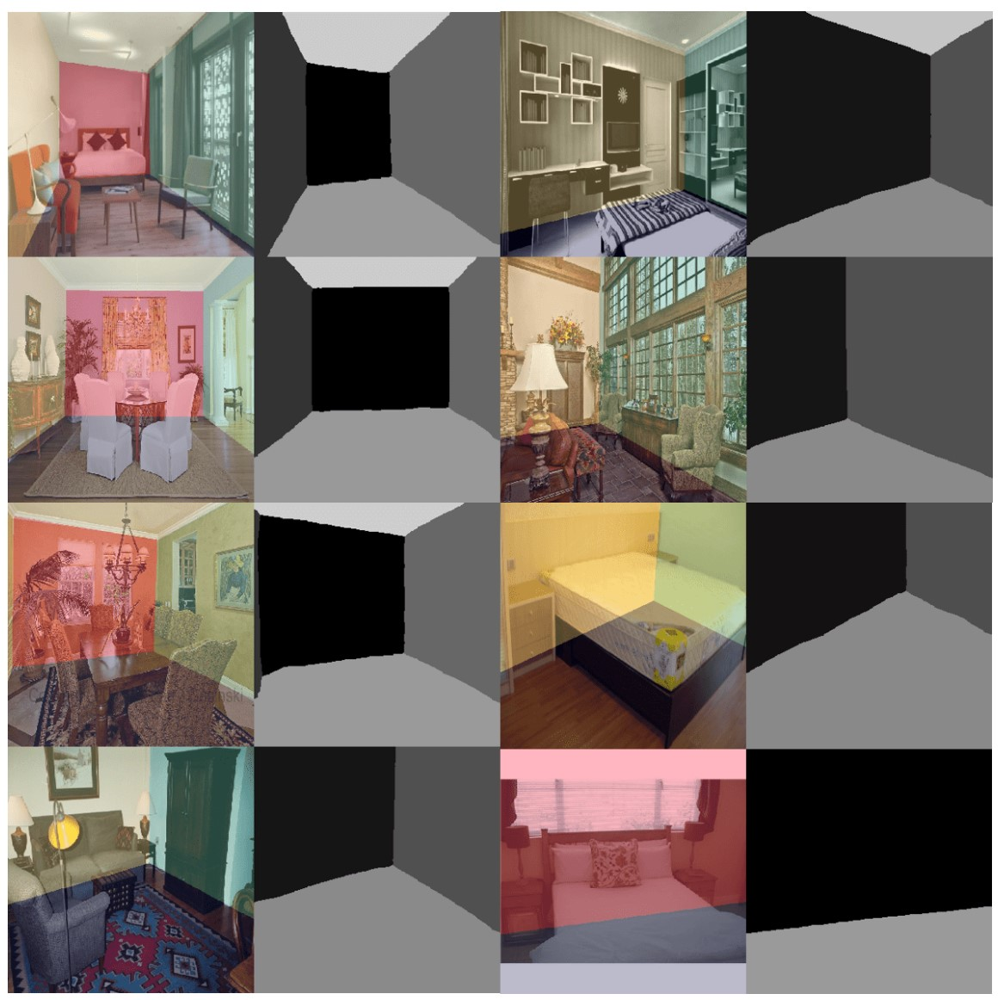

# Indoor Scene Layout Estimation from a Single Image


[Hung Jin Lin](https://tw.linkedin.com/in/hung-jin-lin-5b66119b), [Sheng-Wei Huang](https://www.linkedin.com/in/sheng-wei-huang), [Shang-Hong Lai](https://tw.linkedin.com/in/shang-hong-lai-4913a0b), [Chen-Kuo Chiang](https://www.cs.ccu.edu.tw/~ckchiang/).

International Conference on Pattern Recognition (ICPR), 2018.

## Information

Conference paper in [PDF](./doc/icpr2018_lin_layoutestimation.pdf).

Pre-trained weight at [Google Drive](https://drive.google.com/file/d/1aUJoXM9SQMe0LC38pA8v8r43pPOAaQ-a/view?usp=sharing).

> Cannot provide original checkpoint in paper due to the agreement, so this is a re-trained checkpoint for fast evaluation.

Updated Feb 2021.

## Prerequisite

- Python 3.6+
- PyTorch 1.0+
- [OneGAN](https://github.com/leVirve/OneGAN) newest is okay.
- `pip install -e requirements.txt`

## Dataset

- [LSUN Layout Challenge](http://lsun.cs.princeton.edu/2015.html#layout)
  - Unfortunately, the website of *LSUN Layout Challenge* is down.
- However, we can find them from below links.
  - **Full images and labels dataset**: [LSUN2016_surface_relabel.zip](https://www.dropbox.com/s/85n95ftlp2rn0fq/LSUN2016_surface_relabel.zip?dl=0) from [@yuzhuoren](https://github.com/yuzhuoren/IndoorLayout).
    >*Recommend to use this, the original ground truth of LSUN Room challenge are not perfect.*
  - **Data splits** for [training.mat](https://web.archive.org/web/20180923231343/http://lsun.cs.princeton.edu/challenge/2015/roomlayout/data/training.mat), [validation.mat](https://web.archive.org/web/20180923231343/http://lsun.cs.princeton.edu/challenge/2015/roomlayout/data/validation.mat) and [testing.mat](https://web.archive.org/web/20180923231343/http://lsun.cs.princeton.edu/challenge/2015/roomlayout/data/testing.mat) from the [web archive](https://web.archive.org/web/20190118150204/http://lsun.cs.princeton.edu/2016/).
<!-- - However, the `image.zip` is too large and still unavailable to download from the web archive. -->
  <!-- - layout segments (not perfect) [layout.zip](https://web.archive.org/web/20170221111502/http://lsun.cs.princeton.edu/challenge/2015/roomlayout/data/layout.zip) -->
  <!-- - Fortunately, you can find them in https://github.com/liamw96/pytorch.room.layout#data. [@liamw96](https://github.com/liamw96) provides dataset image in the `lsun.zip` on Google drive! -->

## Usage

Thanks [@shuuchen](https://github.com/shuuchen) for an all-in-one project, you may also refer to <https://github.com/shuuchen/lsun-room-dsc>!

- Training

  - Dataset **LSUN Room Layout Dataset** into folder `./data/lsun_room`.
    - `images/`: RGB color image `*.jpg` of indoor room scene
    - `layout_seg/`: layout ground truth `*.mat` of indoor room scene

  - The trained model will be saved to folder `./ckpts`

  ```bash
  python main.py --phase train --arch resnet --edge_factor 0.2 --l2_factor 0.2 --name baseline
  ```

- Validation

  - Validate on LSUN Room/Hedau datasets.

  ```bash
  python main.py --phase eval --dataset hedau --folder ./data/hedau --pretrain_path {checkpoint_path}
  ```

- Testing

  - On your image

  ```bash
  python demo.py image --weight {checkpoint_path} --path {file_path}
  ```

  - On video and webcam

  ```bash
  # video
  python demo.py video --weight {checkpoint_path} --path {test_video}

  # webcam
  python demo.py video --weight {checkpoint_path} --device 0
  ```

- Toolkit

  - Official `LSUN Room Layout Dataset` toolkit in folder [`./lib/lsun_toolkit`](lib/lsun_toolkit)

  ```bash
  # this is my modified script for usage demonstration,
  # you may need to modify the official Matlab code to evaluate your results.
  matlab -nojvm -nodisplay -nosplash -r "demo('$EXPERIMENT_OUTPUT_FOLDER'); exit;"
  ```

## Citation

```bibtex
@inproceedings{lin2018layoutestimation,
    Author = {Hung Jin Lin and Sheng-Wei Huang and Shang-Hong Lai and Chen-Kuo Chiang},
    Title = {Indoor Scene Layout Estimation from a Single Image},
    Booktitle = {2018 24th International Conference on Pattern Recognition (ICPR)},
    Year = {2018}
}
```

## More Results


